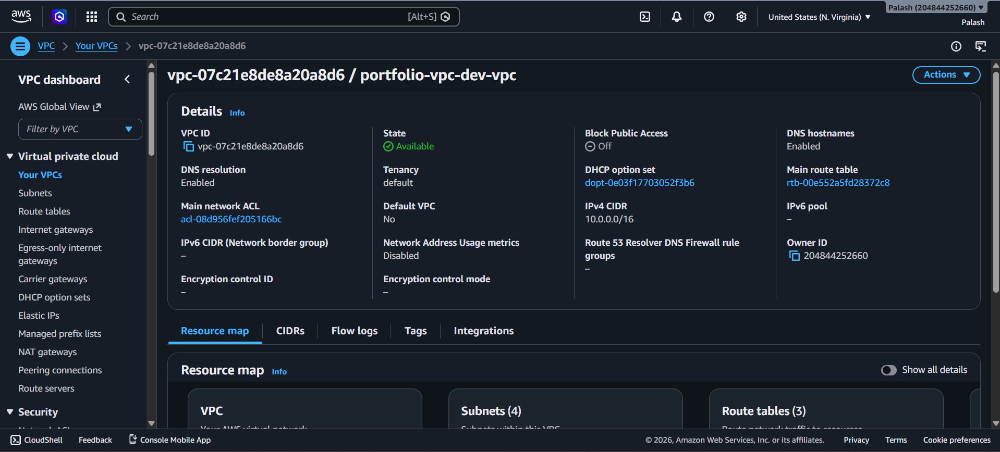
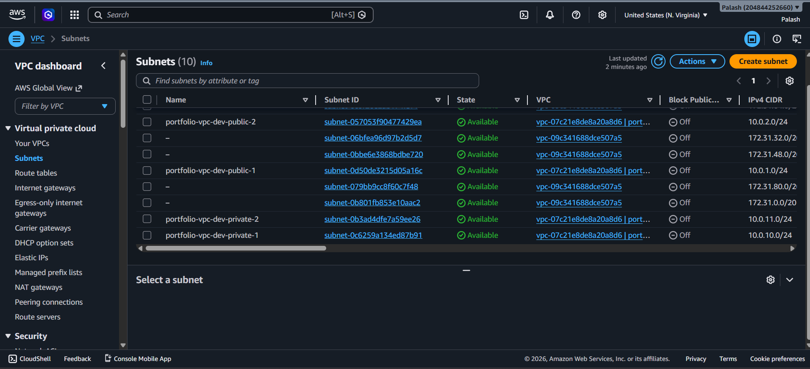
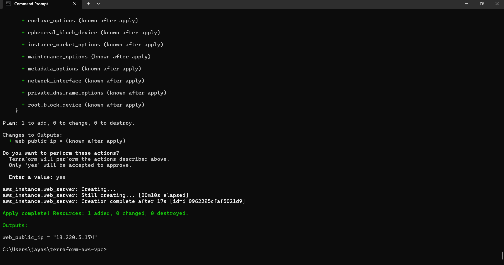

****Reusable Multi-AZ AWS VPC Core (Terraform)****
This repository contains a modular Terraform configuration for deploying a standard, high-availability VPC layout across two Availability Zones (AZs).
It separates public-facing entry points from isolated private layers, utilizing security group chaining to restrict database exposure.

It is designed for rapid environment prototyping (dev/staging/prod) with built-in tag matrices for instant cost attribution.


**** Architecture Overview****
This project provisions a highly secure, isolated network topology split across two distinct physical AWS Availability Zones for high availability:

* **Public Tier (Frontend):** Two public subnets mapped to an Internet Gateway (IGW) to handle external incoming traffic
                           (e.g., Load Balancers, Web Servers).
* **Private Tier (App/DB):** Two isolated private subnets entirely cut off from direct inbound internet traffic, housing core business logic and databases.
* **Outbound Connectivity:** A single, cost-optimized NAT Gateway deployed in the public tier acts as a secure one-way bridge,
                           
1. Infrastructure Topography

## Security & Networking Implementation

* **Security Group Chaining:** The database tier completely blocks the open internet. Access rules explicitly trust *only* the Web Tier's Security Group ID, ensuring zero exposure to external scanning bots.
* **Dynamic AMI & AZ Discovery:** Avoids brittle hardcoding by utilizing native Terraform Data Sources to query live AWS APIs for regional availability zones and the newest verified Amazon Linux images.
* **Unified Tagging Framework:** Enforces strict compliance tags (Environment, Project, ManagedBy) across all provisioned components to enable clear cost visibility and cloud financial optimization (FinOps).

## IP Allocation Engineering Matrix
The 10.0.0.0/16 master block provides 65,536 unique private IP addresses.

## Subnet Design

The VPC is distributed across two Availability Zones to provide high availability and fault tolerance. Public subnets host internet-facing resources, while private subnets isolate application and database workloads.

| Subnet Component | Availability Zone | CIDR Block Allocation | Total Available Host IPs | Intended Architecture Tier |
|-----------------|------------------|----------------------|--------------------------|----------------------------|
| public_subnet_1 | us-east-1a | 10.0.1.0/24 | 251 | Public Web / ELB / NAT Gateway |
| public_subnet_2 | us-east-1b | 10.0.2.0/24 | 251 | Public Web / ELB Layer Backup |
| private_subnet_1 | us-east-1a | 10.0.10.0/24 | 251 | Isolated Application Core / Mid-tier |
| private_subnet_2 | us-east-1b | 10.0.11.0/24 | 251 | Isolated Database Tier (Secure) |

## Variables & Parameter Breakdown

To keep the setup completely decoupled and environment-agnostic, values are managed outside the core modules via `variables.tf`:

```hcl
variable "aws_region" {
  type        = string
  default     = "us-east-1"
  description = "Target deployment region."
}

variable "vpc_cidr" {
  type        = string
  default     = "10.0.0.0/16"
  description = "Root CIDR range for the entire VPC allocation."
}

variable "environment" {
  type        = string
  default     = "dev"
  description = "Deployment lifecycle stage (dev, staging, prod)."
}

variable "enable_single_nat_gateway" {
  type        = bool
  default     = true
  description = "Set to true to share a single NAT Gateway across subnets and cut sandbox environment idle costs."
}

### Prerequisites
* [Terraform](https://developer.hashicorp.com/terraform/downloads) (>= 1.0.0) Installed
* [AWS CLI](https://aws.amazon.com/cli/) Installed and configured with appropriate IAM permissions.

### Cost Optimization & Lifecycle Safeguards
NAT Gateways represent heavy recurring fixed costs (~$32/month per deployment unit baseline). 
To balance production stability with economical sandbox engineering, this blueprint employs standard enterprise lifecycle optimizations:

1)Conditional Deployment Flags: The parameter engine features an explicit boolean toggle (enable_single_nat_gateway). In standard operational sandbox mode, private routing loops handle traffic through a single gateway instance rather than running parallel processing engines across every single Availability Zone.
2)Explicit Deletion Handlers: Real production implementations would augment state tracking protections via prevent_destroy = true lifecycles to insulate mission-critical routing components against accidental removal events.

##  Deployed Infrastructure Metrics & Live Validation

#### 1. Cloud Network Topology Map (AWS Console Verification)
Below is the verification of the 4 distinct multi-AZ subnets successfully provisioned inside the `portfolio-vpc-dev` boundary:



#### 2. Terminal Automation Output (Terraform Apply Success)
Programmatic compilation output proving the clean orchestration of all 14 independent resources:


#### 3. End-to-End Application Traffic Routing (Live Browser Proof)
Direct HTTP packet routing validation executing perfectly across the public subnet boundaries, hitting the verification target:

